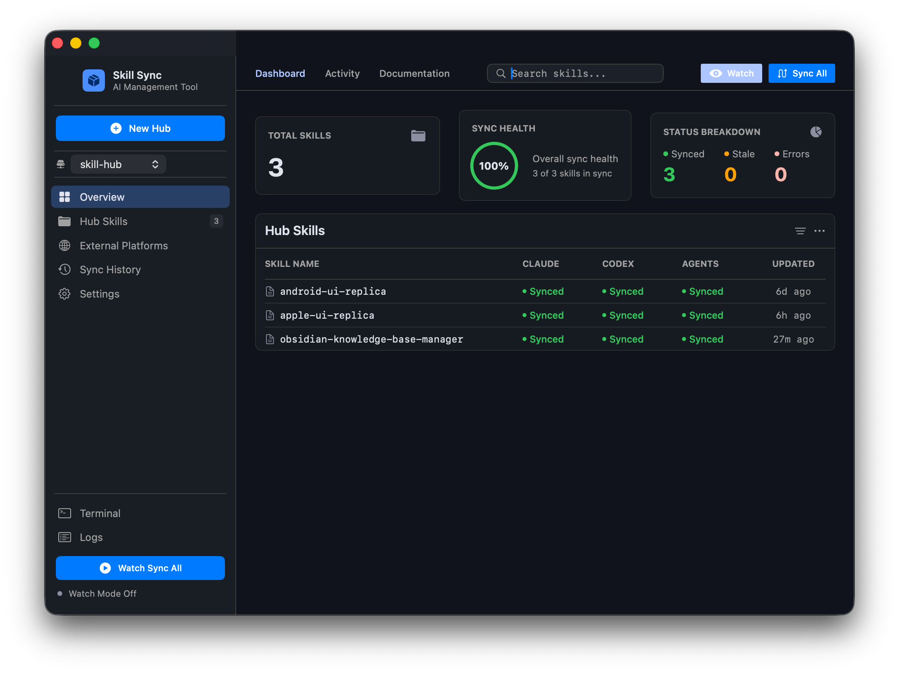

# Skill Hub Desktop

> 一键同步 AI 技能到所有智能体平台 — 干净、快速、原生。

**Skill Hub Desktop** 是一款 macOS 原生工具，以 hub 目录为唯一数据源，将技能同步到 [Claude Code](https://claude.ai/code)、[Codex CLI](https://github.com/openai/codex)、OpenAI Agents SDK 等智能体平台。一键操作，全平台更新。

<p align="center">
  
</p>

---

## 功能特性

### 一键同步
一键将全部技能同步到所有智能体平台。支持**软链模式**（macOS 符号链接，改一处处处生效）和**复制模式**（独立副本，适合稳定分发）。

### 实时监听
开启 Watch 模式后，应用通过原生 FSEvents 监听 hub 目录变更，2 秒防抖后自动同步，无需轮询，不浪费 CPU。

### 多 Hub 管理
在侧边栏切换多个 skill hub。适合将开发中技能与稳定版本分离，或为不同团队管理各自的技能集。

### 文件级差异对比
同步前可逐文件对比 hub 源与智能体端已安装版本。支持行级差异展示（hunks、新增、删除），清楚知道每次变更内容。

### 失效链接检测
自动检测指向错误目标的符号链接（如目录移动后断裂的软链），标记为"stale"状态，避免静默失效。

### 自动备份
每次覆盖前创建带时间戳的备份（`*.backup-20260712-143022`），确认无误后可一键清理。

### 终端集成
在应用内直接运行参考脚本 `sync-skills.sh`，支持选择命令和参数，终端风格流式输出。

---

## 安装

### 下载安装（推荐）

从 [Releases](https://github.com/zhangruitian/skill-hub-desktop/releases) 下载最新 DMG。

1. 打开 `SkillHubDesktop-1.0.0.dmg`
2. 将 **Skill Hub Desktop** 拖入 **应用程序** 文件夹
3. 从启动台打开（如遇 Gatekeeper 提示，右键 → 打开）

> **系统要求**：macOS 13.0 及以上（Ventura / Sonoma / Sequoia），Apple Silicon 芯片。

### 从源码编译

```bash
# 克隆仓库
git clone https://github.com/zhangruitian/skill-hub-desktop.git
cd skill-hub-desktop

# 编译（Swift 5.9+，arm64）
swiftc -parse-as-library \
    -framework SwiftUI -framework Combine -framework AppKit \
    -target arm64-apple-macos13.0 \
    -o SkillHubDesktop \
    SkillHubDesktop/*.swift \
    SkillHubDesktop/Models/*.swift \
    SkillHubDesktop/Services/*.swift \
    SkillHubDesktop/Views/*.swift \
    SkillHubDesktop/Views/Components/*.swift

open SkillHubDesktop
```

**在 Xcode 中打开**（需安装 [`xcodegen`](https://github.com/yonaskolb/XcodeGen)）：

```bash
brew install xcodegen
./setup-xcode.sh
open SkillHubDesktop.xcodeproj
```

### 打包分发

```bash
./package.sh                    # 编译 + 生成 .dmg
./package.sh --sign "证书名称"   # 代码签名
```

---

## 快速上手

1. **启动** Skill Hub Desktop
2. 将 **Hub 根目录** 指向你的技能目录（默认：`~/skill-hub`）。hub 目录结构如下：

   ```
   ~/skill-hub/
   ├── sync-skills.sh
   ├── my-skill/
   │   ├── SKILL.md
   │   └── references/
   └── another-skill/
       └── SKILL.md
   ```

3. 点击 **刷新**，应用会扫描 hub 并检测每个技能在各平台的同步状态
4. 勾选要同步的技能（或直接点击 **全量同步**）
5. 完成 — 智能体下次启动即可加载

---

## 支持的智能体平台

| 平台 | 安装路径 | 对应应用 |
|------|---------|---------|
| **Claude** | `~/.claude/skills/` | Claude Code |
| **Codex** | `~/.codex/skills/` | Codex CLI |
| **Agents** | `~/.agents/skills/` | OpenAI Agents SDK |

可在 **设置 → 智能体** 中添加自定义平台，支持任意本地目录。

---

## 同步状态说明

每个 skill × agent 组合都有对应的状态标记：

| 状态 | 图标 | 含义 |
|------|------|------|
| **已同步** | 🟢 | 软链指向 hub 源，修改自动同步 |
| **已复制** | 🔵 | 独立副本，内容与 hub 一致 |
| **失效链接** | 🟠 | 软链存在但指向错误目标（如目录移动后断裂） |
| **已过期** | 🟡 | 副本存在但内容与 hub 有差异 |
| **未安装** | ⚪ | 该 agent 端尚未安装 |
| **错误** | 🔴 | 操作异常，请查看活动日志 |

---

## 架构

```
Skill Hub Desktop
├── App.swift                   @main 应用入口
├── SkillHubViewModel.swift     MVVM 中央协调器，@MainActor
├── Models/
│   ├── DesignSystem.swift      设计令牌（颜色、字体、布局）
│   ├── SyncState.swift         同步状态枚举
│   ├── AgentConfig.swift       智能体平台模型
│   ├── SkillInfo.swift         技能信息模型
│   ├── AppSettings.swift       UserDefaults 持久化
│   ├── HubProfile.swift        多 Hub 配置
│   └── AppError.swift          结构化错误模型
├── Services/
│   ├── HubManager.swift        Hub 扫描与排除规则
│   ├── AgentManager.swift      智能体增删改查
│   ├── StatusEngine.swift      状态检测（symlink + diff）
│   ├── SyncEngine.swift        同步执行（软链/复制/备份）
│   ├── DiffEngine.swift        文件差异对比（LCS 算法）
│   ├── WatchEngine.swift       FSEvents 监听 + 防抖
│   └── BackupCleaner.swift     备份残留扫描清理
└── Views/
    ├── ContentView.swift       主布局（侧边栏 + 仪表板）
    ├── DiffView.swift          左右分栏差异查看器
    ├── SettingsView.swift      设置面板（4 个标签页）
    ├── TerminalView.swift      命令行执行面板
    ├── StatusView.swift        状态矩阵（调试用）
    └── Components/
        ├── StatusBadge.swift   彩色状态指示器
        └── SkillRow.swift      技能列表行（调试用）
```

**设计模式**：MVVM + Services。`SkillHubViewModel` 是唯一的 `@MainActor` 协调器，View 通过绑定与它交互，不直接调用服务。所有服务标记为 `@unchecked Sendable`，支持安全的后台线程调度。

---

## 设计系统

Skill Hub Desktop 采用 **Terminal Catalyst / Professional Utility** 设计语言 — 纯暗色主题、高对比度、等宽字体点缀。设计令牌统一在 `DesignSystem.swift` 中定义，保证全局一致。

| 令牌 | 色值 | 说明 |
|------|------|------|
| 背景色 | `#10131b` | 应用底色 |
| 容器色 | `#181c23` | 侧边栏、卡片 |
| 主色调 | `#adc6ff` | 宝石蓝 |
| 已同步 | `#34C759` | 翠绿色 |
| 失效/异常 | `#FF9F0A` | 琥珀色 |
| 错误 | `#ffb4ab` | 玫红色 |

---

## 配置参考

在 **设置 → 通用** 中可配置：

| 设置项 | 默认值 | 说明 |
|--------|--------|------|
| Hub 根目录 | `~/skill-hub` | 技能源文件所在目录 |
| 默认安装模式 | 软链 | `link`（符号链接）或 `copy`（独立文件） |
| 自动备份 | 开启 | 覆盖前创建 `*.backup-<时间戳>` |

**忽略规则**（设置 → 忽略）：同步时跳过的 glob 匹配模式，默认包含 `.git`、`docs/`、`agents/`、`node_modules/`、`.DS_Store` 等，可按需增删。

---

## 常见问题

### 同步会删除智能体端已有的技能吗？

不会。Skill Hub Desktop 只新增和覆盖，绝不主动删除。如需移除某个技能，请使用 **取消链接** 功能显式操作。

### 软链还是复制？

- **软链（推荐开发用）**：macOS 符号链接，在 hub 中修改立即反映到所有智能体。
- **复制（推荐分发用）**：独立文件副本，稳定不受 hub 变更影响，但 hub 更新后需手动重新同步。

### 同步后需要重启智能体吗？

通常需要。Claude Code、Codex CLI、Agents SDK 在启动时扫描 skills 目录，运行时不一定能检测到新文件，建议同步后重启或开新会话。

### 可以管理多个 hub 吗？

可以。点击侧边栏 hub 选择器旁的 **+** 号，或使用 **文件 → 新建 Hub**。每个 hub 有独立的技能集和配置。

### 智能体端手动安装的外部技能会受影响吗？

不会。外部技能（非本应用安装的）会在 External Platforms 视图展示，同步操作完全不影响它们。

### 如何清理备份残留？

点击 Hub Skills 表格更多菜单（⋯）中的 **清理备份**，或在终端面板运行 `sync-skills.sh clean-backups`。

---

## 相关资源

- [sync-skills.sh](docs/sync-skills.sh) — 参考 bash 实现（960 行），支持全部命令行操作
- [sync-skills.sh 使用指南](docs/README.md) — shell 脚本完整文档

---

## 许可证

MIT License — 详见 [LICENSE](LICENSE)。

---

<p align="center">
  <sub>使用 SwiftUI + AppKit 构建 • macOS 13.0+ • Apple Silicon</sub>
</p>
